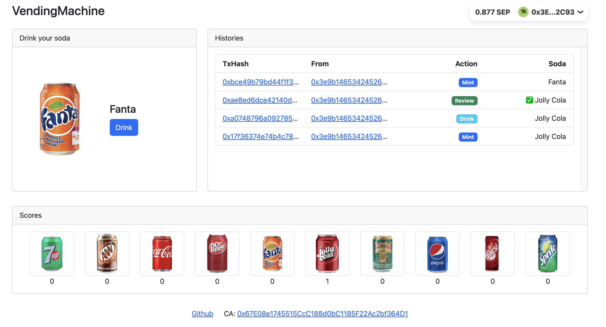

# Vending Machine

Link: [Demo site](https://vending-machine-psi.vercel.app/)

This project is a Vending Machine on **Sepolia Testnet** which you could `mint` a soda, `drink` it and `review` it. All the process flows and results are all computed in the blockchain.

This is the final project of the **Ethereum Bootcamp** by [Alchemy](https://www.alchemy.com/). This project demonstrated the technical skills I have learnt throughout the course, [IPFS](https://www.ipfs.tech/), Solidity, Alchemy-Sdk, rpc-endpoints and more. 

## Flow
1. Mint one random soda as an **NFT** at a time out of the 10 sodas in the Vending Machine
2. Drink (burn) the soda
3. Review the soda that you drank

## Features
- Have integrated alchemy websocket for real time updating scores and all events emitted by the contract

## Packages
- Frontend
	- Rainbowkit + Wagmi + Nextjs 
	- Bootstrap + React-bootstrap
- Smart Contract + IPFS
	- Hardhat
	- kubo-rpc-client

## Contribution
- Feel free to create a pull request and make this vending machine more reliable and flexible

